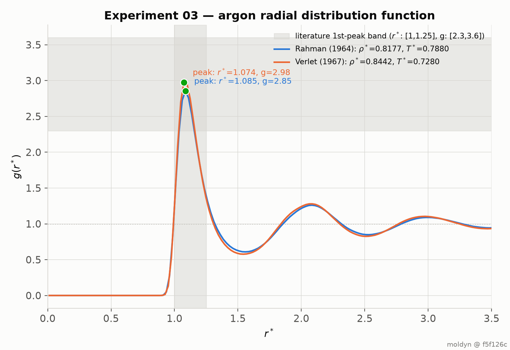
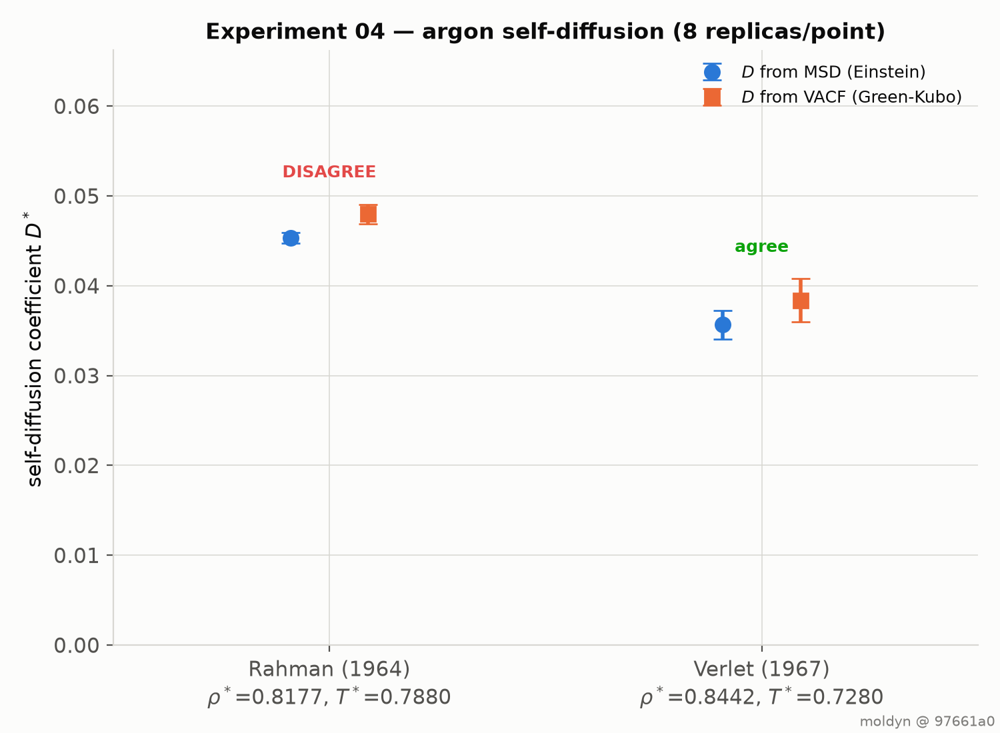
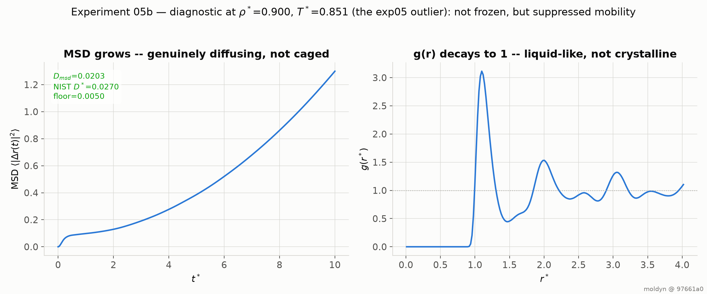

# moldyn

A molecular dynamics engine in C++17, validated against published reference data.

Every number below is produced by a committed script, written to a committed
file, and checked by an assertion that fails the build if it stops holding.

```
git clone https://github.com/VishnuR23/MolecularDynamics && cd MolecularDynamics
make verify        # ~15 seconds, no Python required
```

---

## What it reproduces

| # | Check | Result | Reference |
|---|---|---|---|
| 01 | Lennard-Jones energy and virial | **12/12 match every digit NIST publishes** | [NIST SRSW][nist-lj] |
| 02 | Energy-conservation order | fitted slope **2.004** | velocity-Verlet is second order |
| 03 | Liquid argon structure | first peak r\*=1.085, g=2.84 | Rahman (1964) |
| 03 | Liquid argon structure | first peak r\*=1.074, g=2.98 | Verlet (1967) |
| 04 | Argon self-diffusion | **D\* = 0.04535 ± 0.00077** vs experiment **0.0452** — 0.33% | Rahman (1964), measured |
| 05 | Equation of state | 5 of 6 densities within tolerance | [NIST MD isotherm][nist-props] |
| 05b | ρ\*=0.900 outlier | investigated — [the simulation never melts](docs/findings/2026-09-21-rho090-outlier.md) | — |

The NIST comparison is the load-bearing one. NIST publishes exact atomic
configurations together with the energies and virials they must produce, so
agreement is checkable rather than asserted. Each of the 12 cases is compared
against **the rounding half-width of NIST's own five published significant
figures** — not a round-number tolerance — and the worst case sits at 0.993 of
that bound. Every value agrees to the last digit NIST prints.

`./build/apps/moldyn_run --nist-config data/nist/lj` prints the table and exits
non-zero if any case drifts. It takes 37 ms.

---

## Figures

| | |
|---|---|
|  |  |
| Radial distribution function at both published argon state points, against the literature band. | Self-diffusion by two independent estimators, with Rahman's 1964 laboratory measurement. |



---

## What is actually tested

49 test cases, 10,928 assertions, ~14 seconds.

| Property | How it is checked |
|---|---|
| NIST energy and virial | 4 configurations × 3 truncation schemes, per-value rounding bound |
| Forces | equal the central finite difference of the same code's energy, to 1.3e-8 |
| Integrator order | energy error measured at four timesteps; **fitted log-log slope must be 2** |
| Time reversibility | run forward, negate velocities, run back — atoms return to 1.8e-15 |
| Neighbour lists | cell and Verlet lists give forces identical to brute force at 7e-16 |
| Minimum image | correct across all 27 periodic images, including exactly on the boundary |
| Maxwell–Boltzmann | Kolmogorov–Smirnov test on decorrelated samples: 0.0073 vs 0.0117 critical |
| Nosé–Hoover | the **extended Hamiltonian** conserved to 7e-05, not merely the temperature |
| RDF normalisation | proven flat at 1 for an ideal gas |
| Diffusion coefficients | recover the exact Ornstein–Uhlenbeck result D = kT/mγ to 0.01% |

Two of these were chosen deliberately over easier versions, and both caught real
bugs. Measuring the *scaling* of the energy error rather than its size is what
distinguishes a correct symplectic integrator from one that merely looks correct.
Testing Nosé–Hoover's conserved quantity rather than its temperature caught an
implementation that drove the temperature to target perfectly while its extended
Hamiltonian drifted 56%.

---

## Open findings

Two experiments do not pass, on purpose. Both are investigated and written up
rather than tuned away, and `make reproduce` exits non-zero because of them.

**[ρ\* = 0.900: the simulation never melts](docs/findings/2026-09-21-rho090-outlier.md)** —
the one equation-of-state density that disagrees, by 0.39 in U\* and 2.45 in p\*.
It is not an engine error: three independent trajectories give self-diffusion of
1.5e-5, 2.9e-5 and 3.7e-5 against NIST's 0.027 for the same state point, three
orders of magnitude lower and indistinguishable from zero. The system stays in
the face-centred-cubic lattice it was started from. The protocol is at fault, and
the note says so.

**[Einstein vs Green–Kubo](docs/findings/2026-09-21-exp04-einstein-vs-green-kubo.md)** —
the two diffusion estimators once disagreed systematically, by +0.0026 with the
same sign in 14 of 16 replicas. The cause was centre-of-mass momentum, zeroed
once at lattice construction and allowed to drift back during Langevin
equilibration while the code still assumed it was zero. With the drift removed
the disagreement falls to −0.00043 against a 0.00119 error budget and the sign is
random. The experiment passes because the bug was fixed, not because the bound
moved.

---

## Reproducing

```
make verify       # unit suite + the two correctness gates      ~15 s
make reproduce    # re-runs every experiment and figure         ~11 min
make test         # unit suite only                             ~14 s
```

Every output file records the command line that produced it, the git revision of
the code, and the host. A revision carries a `-dirty` suffix when the engine or
scripts differ from any commit, so a result cannot claim a clean revision it was
not built from.

Runs are deterministic: the same seed on the same binary reproduces bit for bit.
`normal()` is an explicit Box–Muller transform rather than `std::normal_distribution`,
which is not portable across standard libraries.

---

## Layout

```
src/moldyn/       engine — no Python dependency, builds and tests standalone
  core/           Vec3, periodic box, system state (structure of arrays)
  forcefield/     Lennard-Jones: energy, virial, forces, tail corrections
  neighbor/       linked cell list, Verlet list with skin
  integrate/      velocity-Verlet, Langevin (BAOAB), Nosé-Hoover chain
  analyze/        RDF, MSD, VACF, Flyvbjerg-Petersen block averaging
  io/             NIST configuration reader, trajectory output
tests/            49 cases, 10,928 assertions
apps/             moldyn_run — the simulation driver
experiments/      one runner and one plotter per published comparison
results/          committed CSVs and figures
data/nist/        reference configurations, with source URLs and checksums
docs/findings/    investigations of the two open disagreements
```

C++17, CMake ≥ 3.16, no dependencies beyond a vendored copy of doctest. CI builds
and tests on Linux and macOS. Python (numpy, matplotlib) is needed only to render
figures, never to build or test.

---

## Not yet built

Electrostatics (Ewald summation), rigid water via SETTLE, and the SPC/E model —
NIST reference data for these is already committed under `data/nist/spce/`.
Performance work — SIMD and threading — is also outstanding; the current force
kernel is scalar and single-threaded.

MIT licensed.

[nist-lj]: https://www.nist.gov/mml/csd/chemical-informatics-group/lennard-jones-fluid-reference-calculations-cuboid-cell
[nist-props]: https://www.nist.gov/mml/csd/chemical-informatics-group/lennard-jones-fluid-properties
